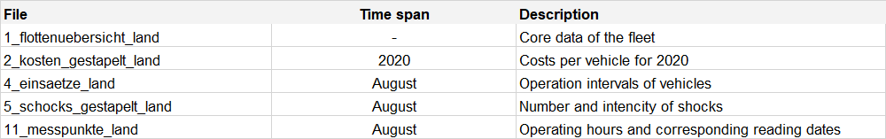

# Case_Study:

In the given Case Study 5 different data are there, which are as below:

 
Case_Study_in_ML folder has following files and directory:

        1. src : it contains the logic of data processing to model creation.
        2. utils: it contains logic to run diffrent predictors for the given dataset(in our case we have 5 datasets & corresponding predictors).
        3. datasets: it contain data for study, however it's empty as data are very large.
        4. output: it holds the various plots and insights about the given data.
        5. case_study.ipynb: it's an interactive jupyter notebook file.
        6. config: it holds the file path or data location.

Thought process:

    1. Data Analyis:
            a. Feature distribution has been generated to see the feature trends.
            b. Correlation of features has been calculated and ploted the same.
            c. Feature engineering has been done to remove column with all null values or column with only one value or junk value.
    2. Predictive modeling:
            a. Based on given data set a predictor is created.
            b. Explanation behind each predictor & subsquent aloirthm is explained in Juypter Notebook.
            c. Model with trained parameters are also saved.

Download the  dependencies:

    pip install -r requirements.txt
